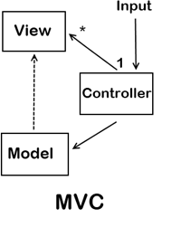

## `DAY 9` 강의 요약

2015.12.02

### RequireJS vs Browerify

TASMA 앱(데모)을 [RequireJS](http://requirejs.org/)와 [Browserify](http://browserify.org/) 방식으로 각각 구현해봅니다.

- CommonJS 방식 구현
- AMD 방식 구현

-

##### Javascript MVC 패턴으로 코드 설계
<!-- 참고 URL: https://www.quora.com/What-should-I-choose-Angular-js-or-NET-MVC-Which-language-has-better-career-prospects -->
TASMA 앱을 MVC 패턴에 따라 역할 별로 설계하여 구현합니다.


> **모델(Model)** ↔ **뷰(View)**<br>
&nbsp;&nbsp;&nbsp;&nbsp;&nbsp;&nbsp;↘&nbsp;&nbsp;&nbsp;&nbsp;&nbsp;&nbsp;&nbsp;&nbsp;&nbsp;&nbsp;&nbsp;&nbsp;&nbsp;&nbsp;&nbsp;&nbsp;&nbsp;↙<br>
&nbsp;&nbsp;&nbsp;**컨트롤러(Controller)**<br>

-


-


-

##### RequireJS(AMD) 방식으로 구현

- AMD 사양의 모듈 정의/사용
- `r.js`를 사용한 최적화 빌드 프로세스

-

##### Browserify(CommonJS) 방식으로 구현

- CommonJS 사양의 모듈 정의/사용
- Browserify/[Watchify](https://github.com/substack/watchify)를 사용한 빌드 프로세스

-

##### 템플릿 라이브러리

- RequireJS - [text 플러그인](https://github.com/requirejs/text) 활용법
- 각 진영에서 [Handlebars](http://handlebarsjs.com/) 템플릿 라이브러리를 활용하는 방법

---

### 수업 실습 코드

#### `index.html`
```html
<!DOCTYPE html>
<html lang="ko-KR">
<head>
	<meta http-equiv="X-UA-Compatible" content="IE=Edge">
	<meta charset="UTF-8">
	<title>TASMA - Task Manager Application</title>
	<meta name="viewport" content="width=device-width, initial-scale=1">
	<link rel="stylesheet" href="css/tasma.css">
	<script src="js/vender/requirejs.min.js" data-main="js/tasma"></script>
</head>
<body>

	<article id="TASMA">

		<header>
			<h1 class="brand black-ops-one">TASMA</h1>
		</header>

		<div role="region" class="toolbar clearfix">
			<button type="button" class="anim button new">등록</button>
			<button type="button" class="anim button remove-all">모두 제거</button>
		</div>

		<div role="main">
			<ul class="tasks-list">
				<!-- 템플릿 코드 삽입 위치 -->
			</ul>
		</div>

		<div role="region" class="toolbar clearfix fixed">
			<button type="button" class="anim button save">저장</button>
			<button type="button" class="anim button cancel">취소</button>
		</div>

	</article>

</body>
</html>
```

-

#### `js/tasma.js`
```js
/*!
 * tasma.js © 2015
 * ------------------------------------
 *
 * 모듈(Module) 의존 구성
 * Model - View - Controller
 * ------------------------------------
 * Main < Tasks(C) < Data Storage(M)
 * 				   < Renderer(V)
 * ------------------------------------
 */

/**
 * requireJS Configuration
 * --------------------------------
 */
require.config({
	'baseUrl': 'js/',
	'paths': {
		'jquery'    : 'vender/jquery-2.1.4.min',
		'text'      : 'vender/text',
		'templates' : '../templates'
	}
});


require(['jquery', 'modules/TaskManager'], function($, TaskManager) {
	'use strict';

	/**
	 * [App - Main]
	 * - registerEventHandler()
	 * - init()
	 * --------------------------------
	 */

	function _registerEventHandler() {
		$.$TASMA.find('.button.new').on('click', TaskManager.add);
		$.$TASMA.find('.tasks-list').on('click', '.button.remove', TaskManager.remove);
		$.$TASMA.find('.button.remove-all').on('click', TaskManager.removeAll);
		$.$TASMA.find('.button.save').on('click', TaskManager.save);
		$.$TASMA.find('.button.cancel').on('click', TaskManager.cancel);
	}

	function init() {
		$.$TASMA = $('#TASMA');
		_registerEventHandler();
		TaskManager.render();
	}

	$(document).ready( init );
	// $(init);

});
```

-

#### `js/modules/TaskData.js`
```js
define([], function() {
	/**
	 * [Model] TaskData
	 * window.localStorage
	 * window.JSON
	 * - load()
	 * - save()
	 * - clear()
	 * --------------------------------
	 */

	var task_name = 'TASMA';

	function dataLoad() {
		var _data = localStorage.getItem( task_name );
		if (_data) {
			return JSON.parse( _data );
		}
		return [];
	}

	function dataSave( data ) {
		data = JSON.stringify( data );
		localStorage.setItem( task_name, data );
	}

	function dataClear() {
		localStorage.removeItem( task_name );
	}

	return {
		'load': dataLoad,
		'save': dataSave,
		'clear': dataClear
	}
});
```

-

#### `js/modules/TaskRenderer.js`
```js
define(['jquery', 'text!templates/render_template.html'], function($, render_template) {
	'use strict';
	/**
	 * [View] TaskRenderer + Template
	 * - renderTask()
	 * - renderTasks()
	 * - renderNew()
	 * --------------------------------
	 */
	// var render_template = [
	// 	'<li class="task clearfix">',
	// 		'<div class="task-desc">',
	// 			'<input class="complete" type="checkbox">',
	// 			'<input class="description" maxlength="24" type="text" placeholder="등록할 내용을 기입해주세요.">',
	// 		'</div>',
	// 		'<button type="button" class="anim button remove">제거</button>',
	// 	'</li>'
	// ].join('');

	function _renderTask( task ) {
		// task란? 객체
		// {
		// 		'complete': true,
		// 		'description': '...'
		// }
		var $tpl = $( render_template );

		if ( task.complete ) {
			$tpl.find('.complete').attr('checked', 'checked');
		}
		$tpl.find('.description').val( task.description );
		return $tpl;
	}

	function renderTasks(tasks) {
		// tasks란? task 객체를 포함하는 배열(집합)
		// [
		// 	{"complete":true,"description":"c"},
		// 	{"complete":false,"description":"b"},
		// 	{"complete":false,"description":"a"}
		// ]
		var $tasksArr = $.map( tasks, _renderTask );
		$.$TASMA.find('.tasks-list').empty().append($tasksArr);
	}

	function renderNew() {
		var $new_task = _renderTask({});
		$.$TASMA.find('.tasks-list').prepend( $new_task );
	}

	return {
		'add': renderNew,
		'renderTasks': renderTasks
	};
});
```

-

#### `js/modules/TaskManager.js`
```js
define(['jquery', 'modules/TaskData', 'modules/TaskRenderer'], function($, TaskData, TaskRenderer) {
	'use strict';
	/**
	 * [Controller] - TaskManager
	 * - addTask()
	 * - render()
	 * - removeAllTasks()
	 * - removeTask()
	 * - saveTask()
	 * - cancelTask()
	 * --------------------------------
	 */
	function addTask() {
		TaskRenderer.add();
	}

	function render() {
		TaskRenderer.renderTasks( TaskData.load() );
	}

	function removeTask(event) {
		var $target = $(event.target);
		$target.closest('.task').remove();
	}

	function removeAllTasks() {
		TaskData.clear();
		render();
	}

	function saveTask() {
		var tasks = [],
			$tasks = $.$TASMA.find('.task');
		$.each( $tasks , function(index, task) {
			var $task = $tasks.eq(index);
			tasks.push( {
				'complete': $task.find('.complete').prop('checked'), // true, false
				'description': $task.find('.description').val()      // '....'
			} );
		});
		TaskData.save( tasks );
	}

	function cancelTask() {
		render();
	}

	return {
		'add'       : addTask,
		'removeAll' : removeAllTasks,
		'remove'    : removeTask,
		'save'      : saveTask,
		'cancel'    : cancelTask,
		'render'    : render
	};

});
```

-

#### `templates/render_template.html`

```html
<li class="task clearfix">
	<div class="task-desc">
		<input class="complete" type="checkbox">
		<input class="description" maxlength="24" type="text" placeholder="등록할 내용을 기입해주세요.">
	</div>
	<button type="button" class="anim button remove">제거</button>
</li>
```